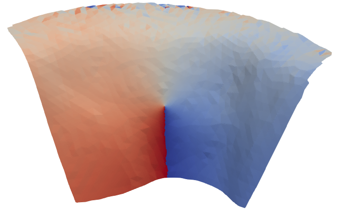
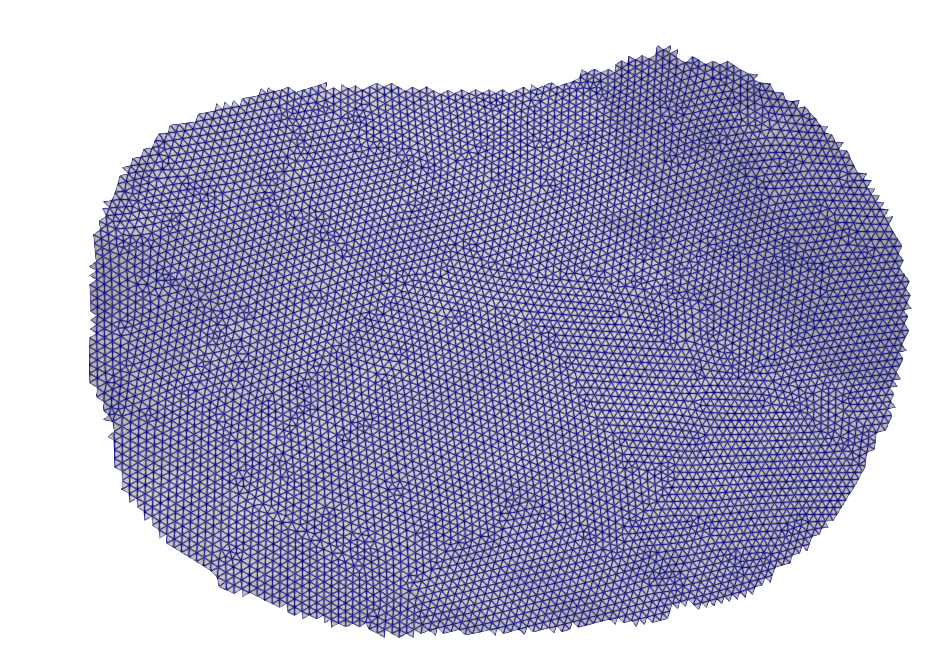
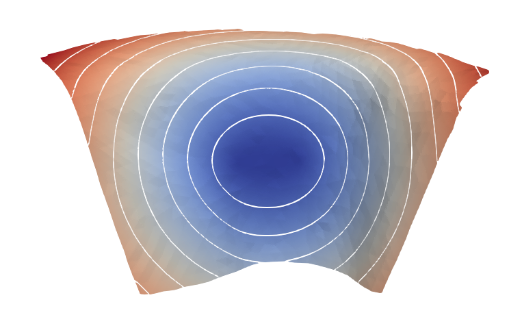
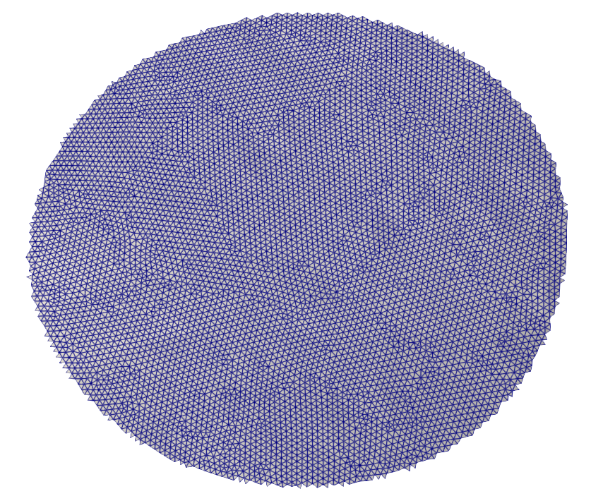
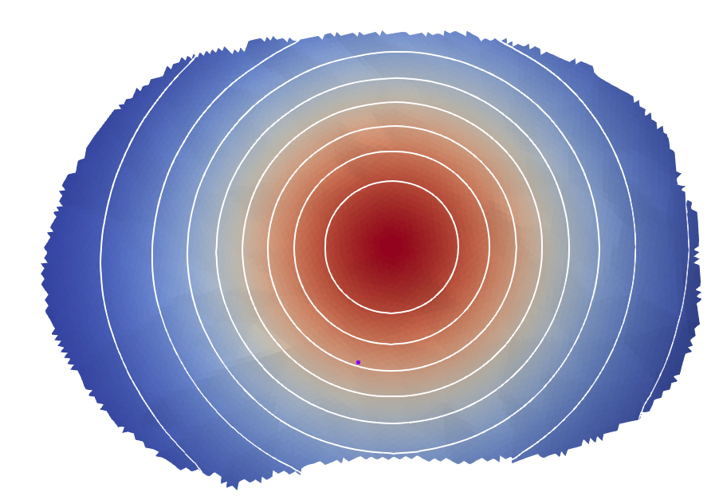

# Scotia slab mesh example

in this directory are present two meshes for the scotia slab. The first one `input.vtk` comes from
the slab 2.0 database. The `input_2km.vtk`is a resampling of the original mesh at 2 km characteristic
sampling.

## step up

All the binary are inside `$HOME_SGRAC/bin` and this directory belongs to your `$PATH`

## mesk extraction of a Mw 8.5 earthquake
### the radial mask approach
#### Step by step approach
##### geometry computation
```bash
sgrac-geometry in=input_2km.vtk out=parent_geom.vtk geometry=theta_ellipse source=33981
```


`theta`: angle in the local down-dip/strike frame.
##### mask estimation
```bash
sgrac-mask in=parent_geom.vtk out=parent_masked.vtk model=ellipse mw=8.5 stressdrop=3.0e6 anis=0.2
```


`mask`: mesh selection for a Mw 8.5 event with a .2 anisotropy along the strike direction (`theta=90` which is the default direction).
##### mask extraction
```bash
sgrac-extract in=parent_masked.vtk out=rupture.vtk
```


`extraction`: mesh extraction compatible with a Mw 8.5 event.

The extracted mesh is compactly renumbered: node ids in `rupture.vtk` are local
child ids and do not preserve parent or source node ids such as `33981`.

#### pipeline approach

The same result may be obtained with a unique command line:
```bash
sgrac-geometry in=input_2km.vtk geometry=theta_ellipse source=33981 | sgrac-mask model=ellipse mw=8.5 stressdrop=3.0e6 anis=0.2 | sgrac-extract out=rupture.vtk
```

or

```bash
sgrac-geometry geometry=theta_ellipse source=33981 < input_2km.vtk | sgrac-mask model=ellipse mw=8.5 stressdrop=3.0e6 anis=0.2 | sgrac-extract > rupture.vtk
```

### the elliptic mask approach
#### Step by step approach
##### geometry computation
```bash
sgrac-geometry in=input_2km.vtk out=parent_foci_geom.vtk geometry=foci_ellipse focus1_node=10441 focus2_node=21408
```


`geodetic distance sum`: sum of the geodetic distances from the two focii nodes on the whole scotia slab.

##### mask estimation
```bash
sgrac-mask in=parent_foci_geom.vtk out=parent_foci_masked.vtk geometry=foci_ellipse mw=8.5 stressdrop=3.0e6
```
outputs:

```bash
sgrac-mask diagnostics:
  mode = foci_ellipse
  threshold mode = magnitude
  mw =   8.5000000000000000E+00
  stressdrop =   3.0000000000000000E+06
  M0 =   7.0794578438414024E+21
  req =   1.0106922469153105E+05
  Atarget =   3.2091331822000347E+10
  Atotal =   1.9813985559927689E+11
  Aselected =   3.2091648693014702E+10
  used_threshold =   2.1143804577766970E+05
  source node 1 = 10441
  source node 2 = 21408
  masked cells = 13265
```


`mask`: mask deduced from the ellipse shape versus the target area for a Mw 8.5 

##### mask extraction
```bash
sgrac-extract in=parent_foci_masked.vtk out=rupture_foci.vtk
```


`extraction`: mesh extraction compatible with a Mw 8.5 event.

The extracted mesh is compactly renumbered: node ids in `rupture.vtk` are local
child ids and do not preserve parent.

#### pipeline approach

The same result may be obtained with a unique command line:
```bash
sgrac-geometry in=input_2km.vtk geometry=foci_ellipse focus1_node=10441 focus2_node=21408 | sgrac-mask geometry=foci_ellipse mw=8.5 stressdrop=3.0e6 | sgrac-extract out=rupture_foci.vtk
```

or

```bash
sgrac-geometry geometry=foci_ellipse focus1_node=10441 focus2_node=21408 < input_2km.vtk | sgrac-mask geometry=foci_ellipse mw=8.5 stressdrop=3.0e6 | sgrac-extract > rupture_foci.vtk
```

## standard slip distribution on a mesh
### a gaussian distribution
```bash
sgrac-slip-smooth in=rupture.vtk out=slip_raw.vtk center_node=5702 sigma=50000.0 mw=8.5
```
Note that the id nodes have been reset with `sgrac_extract` and a new id node must be chosen for the center of the gaussian.
ouputs:
```bash
sgrac-slip-smooth diagnostics:
  mode = physical
  mw =   8.5000000000000000E+00
  mu =   3.0000000000000000E+10
  target M0 =   7.0794578438414024E+21
  unscaled M0 =   3.9973347012000337E+20
  final M0 =   7.0794578438414328E+21
  peak slip =   1.7701514077889069E+01
```



`slip`: slip distribution and its contours

