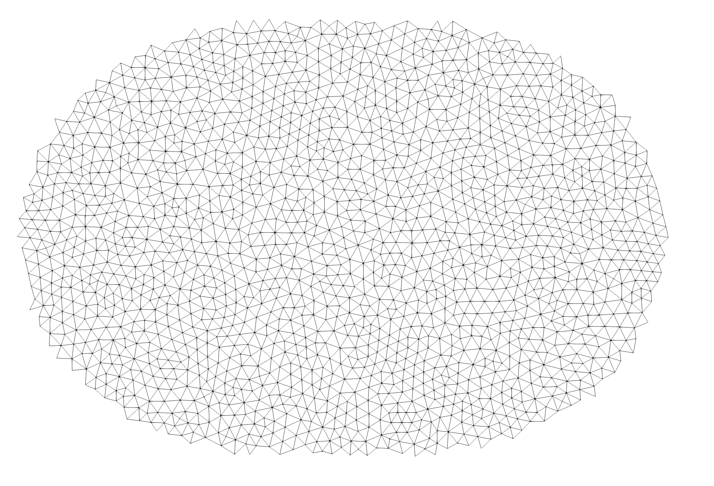

# sgrac-extract v0

`sgrac-extract` is the fourth SGRAC filter. It reads a VTK legacy `POLYDATA` triangular mesh containing a `CELL_DATA` scalar mask field, extracts selected triangles, and writes a compact child `POLYDATA` mesh.

The output intentionally contains geometry only:

```text
POINTS
POLYGONS
```

No `POINT_DATA` or `CELL_DATA` are written.

## Interface

Pipeline style:

```bash
sgrac-extract < parent_masked.vtk > rupture.vtk
```

File-output style:

```bash
sgrac-extract in=parent_masked.vtk out=rupture.vtk
```

Arguments use the project `forparse` `key=value` convention.

| key | meaning | default |
|---|---|---:|
| `field` | `CELL_DATA` scalar field to use | `mask` |
| `value` | integer value to keep | `1` |
| `in` | optional input VTK file | stdin |
| `out` | optional output VTK file | stdout |

## Selection

Cell `i` is kept if:

```text
int(field(i)) == value
```

The requested field must exist. At least one triangle must be selected.
The default behavior is therefore to extract the rupture mask:

```text
mask == 1
```

## Node Numbering

The child mesh is compactly renumbered.

If parent node `1` belongs to the selected cell set, it remains child node `1`. Other surviving nodes are then numbered from `2` upward in ascending parent-node order.

If parent node `1` is not selected, surviving nodes are numbered compactly from `1` upward in ascending parent-node order.

## Example

```bash
../sgrac_gmsh_support/sgrac-gmsh-support lx=120000 lz=80000 lc=500 > parent.vtk
../sgrac_geometry/sgrac-geometry source=1 < parent.vtk > parent_geom.vtk
../sgrac_mask/sgrac-mask mw=6.5 stressdrop=3e6 model=ellipse anis=0.2 < parent_geom.vtk > parent_masked.vtk
./sgrac-extract < parent_masked.vtk > rupture.vtk
```

Expected result:

- `rupture.vtk` contains only `POINTS` and `POLYGONS`.
- No attributes are present.
- The mesh is compactly renumbered.
- If parent node `1` is in the rupture, it remains node `1`.

## Figure


`rupture`: wireframe of the extracted mesh.

## Build

```bash
make
```
