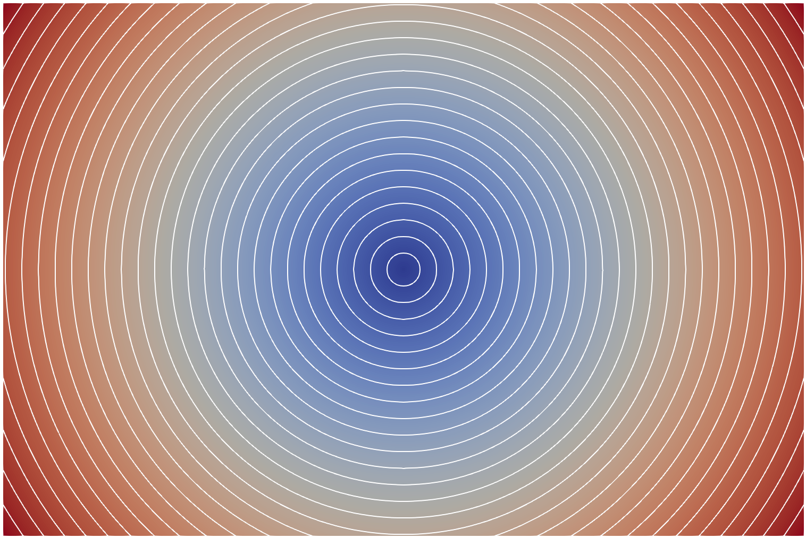
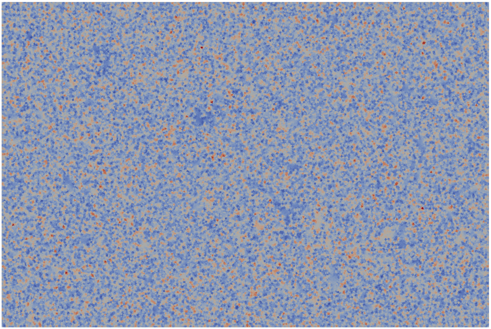
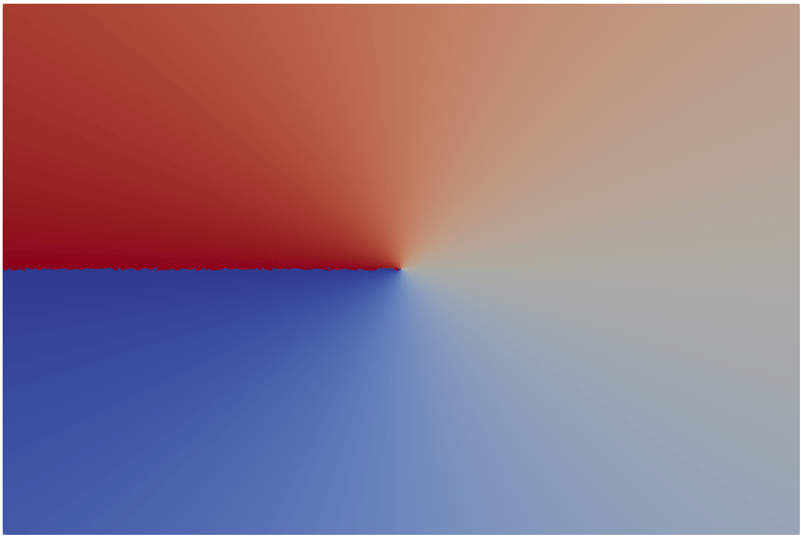

# sgrac-geometry v0

`sgrac-geometry` is the second SGRAC filter. It reads a constrained VTK legacy triangular surface mesh, rebuilds the `trilat-distance` topology (`ntoc`, `nton`), computes geodesic distance from a source node, derives cellwise geometry fields, and writes VTK legacy `POLYDATA`.

## Interface

```bash
./sgrac-geometry source=1 < parent.vtk > parent_geom.vtk
```

or:

```bash
./sgrac-geometry in=parent.vtk out=parent_geom.vtk source=1
```

`source` is a 1-based Fortran node index. For meshes from `sgrac-gmsh-support`, the rectangle center is `source=1`.
`source_vtk` may be used instead for a 0-based VTK/ParaView point id.

## Output fields

Point data:

- `dg`: nodal geodesic distance, in meters

Cell data:

- `area`: triangle area, in m2
- `dg_cell`: cell-average geodesic distance, in meters
- `theta`: cellwise angle in radians, from the local horizontal direction on the fault surface; positive toward increasing z/depth
- `centroid`: cell centroid, in meters
- `grad_dg`: P1 triangle gradient of `dg`, dimensionless

## Figures


`dg`: nodal geodesic distance.


`area`: triangle area.


`theta`: cellwise propagation angle.

## Notes

- S.I. units only.
- Triangles only.
- No `CELL_TYPES`; the mesh is written as VTK legacy `POLYDATA` with `POLYGONS`.
- Topology is rebuilt every run using `compntoc` and `compnton` from `trilat-distance`.
- This package intentionally does not modify `trilat-distance`.
