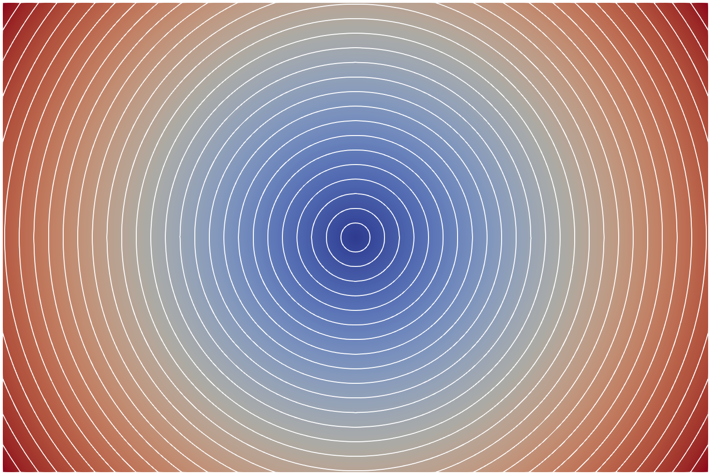
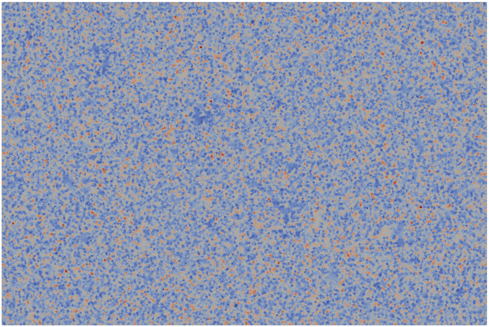
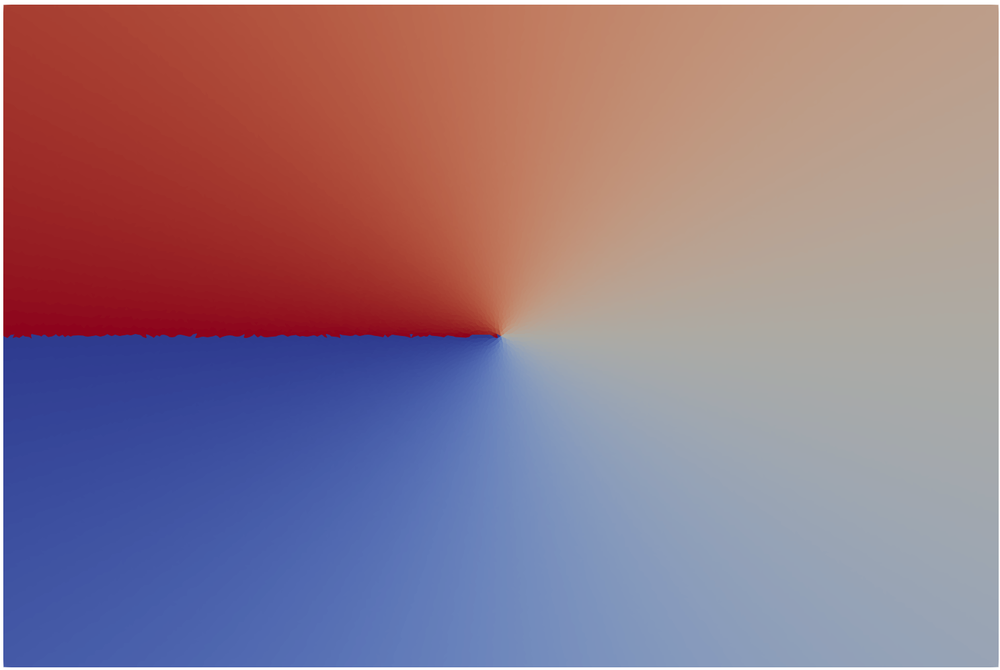

# sgrac-geometry

`sgrac-geometry` is the second SGRAC filter. It reads a constrained VTK legacy triangular surface mesh, rebuilds the `trilat-distance` topology (`ntoc`, `nton`), computes geodesic distance from a source node, derives cellwise geometry fields, and writes VTK legacy `POLYDATA`.

## Interface

```bash
./sgrac-geometry source=1 < parent.vtk > parent_geom.vtk
```

or:

```bash
./sgrac-geometry in=parent.vtk out=parent_geom.vtk source=1
```

`source` is a 1-based Fortran node index. For meshes from `sgrac-gmsh-support`, the rectangle center is `source=1`.
`source_vtk` may be used instead for a 0-based VTK/ParaView point id.

The default geometry mode is:

```bash
./sgrac-geometry in=parent.vtk out=parent_geom.vtk geometry=theta_ellipse source=1
```

Foci-ellipse geometry preparation can be selected with:

```bash
./sgrac-geometry in=parent.vtk out=parent_foci_geom.vtk geometry=foci_ellipse focus1_node=10 focus2_node=200
```

`focus1_node` and `focus2_node` are 1-based Fortran node indexes and must be distinct. `focus1_vtk` and `focus2_vtk` may be used instead for 0-based VTK/ParaView point ids.

## Output fields

Point data:

- `dg`: nodal geodesic distance, in meters

Cell data:

- `area`: triangle area, in m2
- `dg_cell`: cell-average geodesic distance, in meters
- `theta`: cellwise local bearing of the geodesic-distance gradient, in degrees; `theta=0` points along the projected downward/down-dip direction, and positive theta is measured toward local strike as defined by an upward-looking cell normal
- `centroid`: cell centroid, in meters
- `grad_dg`: P1 triangle gradient of `dg`, dimensionless

Foci-ellipse mode writes:

Point data:

- `dg_f1`: nodal geodesic distance from focus 1, in meters
- `dg_f2`: nodal geodesic distance from focus 2, in meters

Cell data:

- `area`: triangle area, in m2
- `dg_f1_cell`: cell-average geodesic distance from focus 1, in meters
- `dg_f2_cell`: cell-average geodesic distance from focus 2, in meters
- `dg_sum_cell`: sum of `dg_f1_cell` and `dg_f2_cell`, in meters; this is the scalar future foci-ellipse masking will consume
- `centroid`: cell centroid, in meters

Foci-ellipse geometry uses `mask_geometry_type_code=3`; `theta` is not used and is not written in this mode.

## Figures


`dg`: nodal geodesic distance.


`area`: triangle area.


`theta`: cellwise propagation angle in the local down-dip/strike frame.

## Notes

- S.I. units for dimensional quantities; angular `theta` output is in degrees for VTK inspection.
- Triangles only.
- No `CELL_TYPES`; the mesh is written as VTK legacy `POLYDATA` with `POLYGONS`.
- The inline input is managed by the `forparse` module
- Topology is rebuilt every run using `compntoc` and `compnton` from `trilat-distance`.
- This package intentionally does not modify `trilat-distance`.
