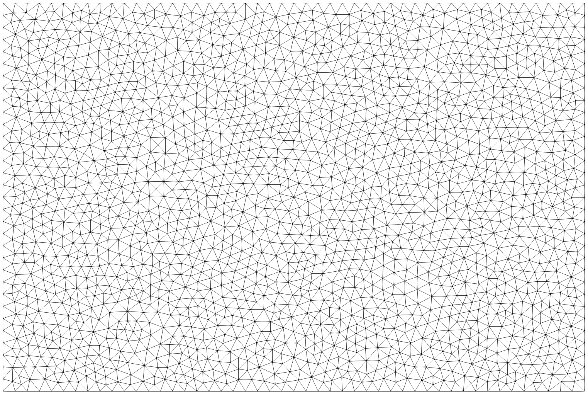

# sgrac-gmsh-support v1

First SGRAC parent-mesh generator using the real Gmsh Fortran API and the real `forparse` module.

## Role

`sgrac-gmsh-support` creates the large planar triangular fault-support mesh used before rupture-domain masking.
It does **not** compute distance, theta, masking, extraction, slip, or rupture time.

The mesh is generated in the x-z plane at constant `y0`. The z axis represents depth and is positive downward.

## Units

Strict S.I. units:

- length: meters
- coordinates: meters
- mesh size `lc`: meters

Default benchmark-oriented values:

```bash
lx=120000
lz=80000
lc=500
```

## Build

Edit `GMSH_LIB_DIR` if needed, then:

```bash
make
```

or:

```bash
make GMSH_LIB_DIR=/path/to/gmsh-sdk/lib
```

## Run

Pipeline style:

```bash
./sgrac-gmsh-support lx=120000 lz=80000 lc=500 > parent.vtk
```

File-output style:

```bash
./sgrac-gmsh-support lx=120000 lz=80000 lc=500 out=parent.vtk
```

## Interface

Arguments use the `forparse` `key=value` style.

| key | meaning | default |
|---|---|---:|
| `lx` | support length, m | 120000 |
| `lz` | support depth span, m | 80000 |
| `lc` | target mesh size, m | 500 |
| `x0` | support center x, m | 0 |
| `y0` | support plane y, m | 0 |
| `z0` | support center z, m | 0 |
| `out` | optional output file | stdout |

The Gmsh 2D mesh algorithm is fixed to `5` (Delaunay).

## Output format

VTK legacy `POLYDATA`:

```text
POINTS n double
POLYGONS ntri 4*ntri
```

No `CELL_TYPES` are written. SGRAC assumes triangular surface meshes by design.
Only points referenced by the output triangles are written, and the embedded support center `(x0,y0,z0)` is always written first.

A small `FIELD FieldData` block stores `lx_m`, `lz_m`, `lc_m`, and `gmsh_algorithm` for diagnostics.

## Figure


`mesh`: wireframe of the triangular support mesh.
