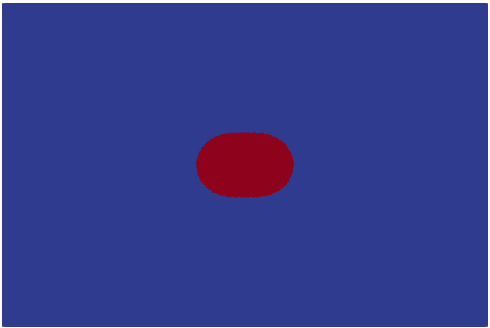
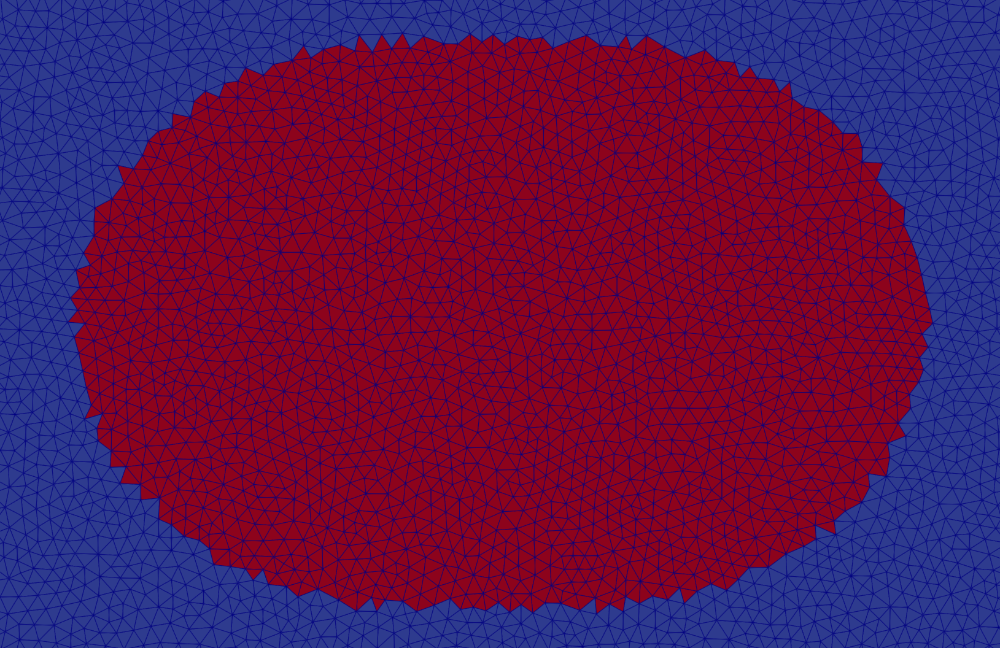

# sgrac-mask v0

`sgrac-mask` is the first rupture-boundary operator for SGRAC.

It reads a SGRAC VTK legacy `POLYDATA` file produced by `sgrac-geometry`, uses existing `CELL_DATA` fields, computes a radius law `R(theta)`, and appends or replaces the rupture mask fields.

## Interface

Debug/geometric scaling:

```bash
sgrac-mask in=parent_geom.vtk out=parent_masked.vtk model=ellipse r0=18000 anis=0.2 theta0=0
```

Physical moment scaling:

```bash
sgrac-mask in=parent_geom.vtk out=parent_masked.vtk model=ellipse mw=6.0 stressdrop=3.0e6 anis=0.2 theta0=0
```

Optional border smoothing:

```bash
sgrac-mask in=parent_geom.vtk out=parent_masked.vtk model=ellipse mw=6.0 stressdrop=3.0e6 anis=0.2 smooth_border=1 smooth_border_iter_max=1000 smooth_border_aperture_max=60
```

All dimensional quantities are S.I. units.

## Implemented radius model

Only one model is implemented in v0:

```text
model=ellipse
```

with dimensionless shape:

```text
f(theta) = 1 + anis * cos(2 * (theta - theta0))
```

Parameters:

```text
r0      reference radius in meters; if present, debug/geometric scaling is used
mw      moment magnitude; required if r0 is absent
stressdrop  stress drop in Pa; required if r0 is absent
mu      shear modulus in Pa, default 3.0e10; only used in physical diagnostics
anis    anisotropy coefficient, default 0
theta0  preferred elongation direction in radians, default 0
rmin    optional lower clipping radius in meters, default 0; debug/geometric mode only
smooth_border  optional mask post-processing, default 0
smooth_border_iter_max  maximum number of iterative border swaps, default ncell
smooth_border_aperture_max  maximum candidate aperture angle in degrees, default 60.0
```

If `r0` is present, the radius is:

```text
R(theta) = r0 * f(theta)
```

If `r0` is absent, `sgrac-mask` computes:

```text
M0 = 10.0**(1.5*mw + 9.1)
req = (7.0*M0/(16.0*stressdrop))**(1.0/3.0)
Atarget = pi * req**2
```

Then it finds `alpha` by bisection so that the masked cell area is close to `Atarget`:

```text
R(theta) = alpha * f(theta)
```

`model=ellipse` is the only implemented model in v0.

## Appended fields

The program preserves the input VTK text and appends, or replaces if already present:

```text
CELL_DATA:
    Rtheta
    phi
    mask
```

where:

```text
phi = dg_cell - Rtheta
mask = 1 if phi < 0, else 0
```

If `smooth_border=1`, `sgrac-mask` applies an iterative mask post-processing step before writing the final `mask` field:

- recompute border connectivity and candidate aperture angles on the current mask;
- select one `mask=1` cell with exactly two border edges for removal, choosing the smallest aperture angle and breaking ties with largest `phi`;
- select one `mask=0` cell with exactly two edges adjacent to selected cells for addition, choosing the smallest aperture angle and breaking ties with smallest `phi`;
- stop when either side has no candidate, after `smooth_border_iter_max` swaps, or when the best removal or addition aperture exceeds `smooth_border_aperture_max`;
- only shared edges between `mask=1` and `mask=0` cells are border edges.

For a triangular candidate, the aperture is the internal triangle angle at the vertex shared by its two mask-border edges, computed from the VTK point coordinates. Edges with `mask=1` on one side and no neighboring cell on the other side are not treated as border edges in this step. `Rtheta` and `phi` remain the original radius-law diagnostics; `mask` is the final post-processed selection.

## Figures


`mask`: rupture mask.


`mask_zoom`: zoom on the rupture mask including the wireframe.

## Build

```bash
make
```

This package uses the project `forparse` convention for `key=value` arguments.
