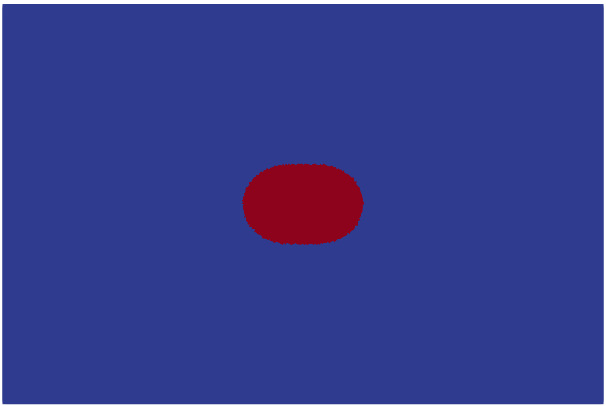
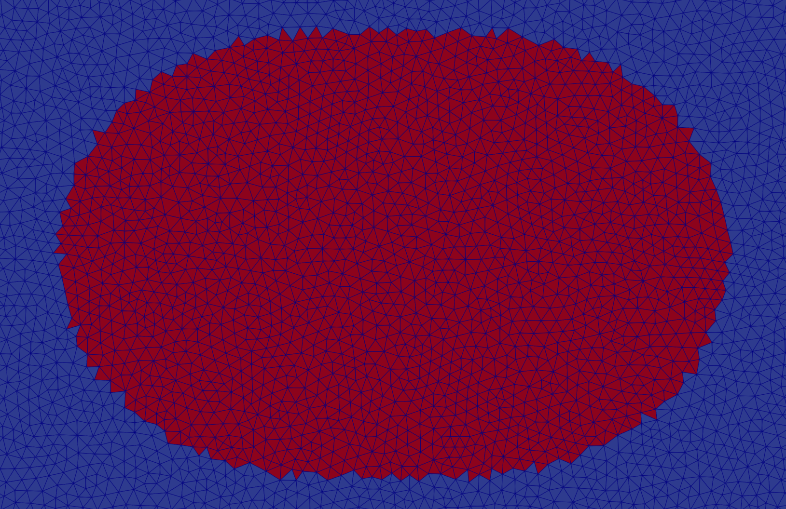

# sgrac-mask

`sgrac-mask` is the first rupture-boundary operator for SGRAC.

It reads a SGRAC VTK legacy `POLYDATA` file produced by `sgrac-geometry`, uses existing `CELL_DATA` fields, computes a radius law `R(theta)`, and appends or replaces the rupture mask fields.

## Interface

Debug/geometric scaling:

```bash
sgrac-mask in=parent_geom.vtk out=parent_masked.vtk model=ellipse r0=18000 anis=0.2
```

Physical moment scaling:

```bash
sgrac-mask in=parent_geom.vtk out=parent_masked.vtk model=ellipse mw=6.0 stressdrop=3.0e6 anis=0.2
```

Optional border smoothing:

```bash
sgrac-mask in=parent_geom.vtk out=parent_masked.vtk model=ellipse mw=6.0 stressdrop=3.0e6 anis=0.2 smooth_border=1 smooth_border_iter_max=1000 smooth_border_aperture_max=60
```

Foci-ellipse explicit threshold:

```bash
sgrac-mask in=parent_foci_geom.vtk out=parent_foci_masked.vtk geometry=foci_ellipse threshold=85000.0
```

Foci-ellipse magnitude threshold:

```bash
sgrac-mask in=parent_foci_geom.vtk out=parent_foci_masked.vtk geometry=foci_ellipse mw=6.0 stressdrop=3.0e6
```

All dimensional quantities are S.I. units. User-facing angles are in degrees.

## Mask Models

Theta-ellipse geometry uses the radius model:

```text
model=ellipse
```

with dimensionless shape:

```text
f(theta) = 1 + anis * cos(2 * (theta - theta0))
```

`theta` and `theta0` are converted to radians internally before this expression is evaluated.

Parameters:

```text
r0      reference radius in meters; if present, debug/geometric scaling is used
mw      moment magnitude; required if r0 is absent
stressdrop  stress drop in Pa; required if r0 is absent
mu      shear modulus in Pa, default 3.0e10; only used in physical diagnostics
anis    anisotropy coefficient, default 0
theta0  preferred elongation direction in degrees, default 90; theta0=0 aligns with local down-dip, theta0=90 aligns with local strike
rmin    optional lower clipping radius in meters, default 0; debug/geometric mode only
smooth_border  optional mask post-processing, default 0
smooth_border_iter_max  maximum number of iterative border swaps, default ncell
smooth_border_aperture_max  maximum candidate aperture angle in degrees, default 60.0
```

If `r0` is present, the radius is:

```text
R(theta) = r0 * f(theta)
```

If `r0` is absent, `sgrac-mask` computes:

```text
M0 = 10.0**(1.5*mw + 9.1)
req = (7.0*M0/(16.0*stressdrop))**(1.0/3.0)
Atarget = pi * req**2
```

Then it finds `alpha` by bisection so that the masked cell area is close to `Atarget`:

```text
R(theta) = alpha * f(theta)
```

`model=ellipse` is the only implemented model in v0.

`theta` is read from `sgrac-geometry` in degrees as a cellwise local bearing of the geodesic-distance gradient.
With the current convention, `theta=0` points along the projected downward/down-dip direction and positive `theta` is measured toward local strike as defined by an upward-looking cell normal.
Consequently, `theta0=0` elongates the mask down-dip/up-dip, while `theta0=90` elongates it along strike. The default is `theta0=90`, so an anisotropic ellipse is strike-aligned unless the user requests another direction. `sgrac-mask` converts angles to radians internally before evaluating the radius law.

Migration note from the former horizontal/strike-zero convention: old parameter files that used `theta0=0` for an along-strike ellipse should now use `theta0=90`. In general, use `theta0_new = theta0_old + 90` degrees, modulo 180 degrees. This is equivalent to `theta0_new = theta0_old + pi/2` modulo `pi` when working in radians.

Foci-ellipse geometry uses `mask_geometry_type_code=3` and the VTK field convention `POINT_DATA` scalars `dg_f1`, `dg_f2` plus `CELL_DATA` scalars `dg_f1_cell`, `dg_f2_cell`, and `dg_sum_cell`. In explicit-threshold foci mode, `sgrac-mask` uses:

```text
phi = dg_sum_cell - threshold
mask = 1 if dg_sum_cell <= threshold, else 0
```

`threshold` is in meters, like `dg_sum_cell`. This mode is useful for tests and reproducible geometric experiments.

When `threshold` is absent, foci-ellipse mode derives the threshold from magnitude:

```text
M0 = 10.0**(1.5*mw + 9.1)
req = (7.0*M0/(16.0*stressdrop))**(1.0/3.0)
Atarget = pi * req**2
```

Then `sgrac-mask` sorts cells by increasing `dg_sum_cell`, accumulates `area`, and selects the smallest threshold for which the cumulative area reaches or exceeds `Atarget`.

Foci-ellipse parameters:

```text
threshold   explicit geodesic ellipse threshold in meters
mw          moment magnitude used to derive target rupture area when threshold is absent
stressdrop  stress drop in Pa, required with mw when threshold is absent
```

Magnitude mode is the default geophysical mode for foci ellipse when `threshold` is absent. `theta`, `theta0`, and `anis` are not used by foci-ellipse masks.

When `dg_f1`, `dg_f2`, and focus metadata are available, an explicit `threshold` must be at least the geodesic distance between the two foci within numerical tolerance. Magnitude mode may warn instead of failing if the discrete cumulative-area threshold is close to this degeneracy. The program warns when the threshold degenerates toward the focus-to-focus segment, when it is below `min(dg_sum_cell)` and the mask will be empty, or when it is at least `max(dg_sum_cell)` and the mask will include the whole mesh.

## Appended fields

The program preserves the input VTK text and appends, or replaces if already present:

```text
CELL_DATA:
    Rtheta
    phi
    mask
```

where:

```text
theta mode:
phi = dg_cell - Rtheta
mask = 1 if phi < 0, else 0

foci mode:
phi = dg_sum_cell - used_threshold
Rtheta = used_threshold
mask = 1 if phi <= 0, else 0
```

For foci-ellipse mode, `Rtheta` is retained only for compatibility and stores the constant selected threshold. It is not a theta-dependent radius.

If `smooth_border=1`, `sgrac-mask` applies an iterative mask post-processing step before writing the final `mask` field:

- recompute border connectivity and candidate aperture angles on the current mask;
- select one `mask=1` cell with exactly two border edges for removal, choosing the smallest aperture angle and breaking ties with largest `phi`;
- select one `mask=0` cell with exactly two edges adjacent to selected cells for addition, choosing the smallest aperture angle and breaking ties with smallest `phi`;
- stop when either side has no candidate, after `smooth_border_iter_max` swaps, or when the best removal or addition aperture exceeds `smooth_border_aperture_max`;
- only shared edges between `mask=1` and `mask=0` cells are border edges.

For a triangular candidate, the aperture is the internal triangle angle at the vertex shared by its two mask-border edges, computed from the VTK point coordinates. Edges with `mask=1` on one side and no neighboring cell on the other side are not treated as border edges in this step. `Rtheta` and `phi` remain the original radius-law diagnostics; `mask` is the final post-processed selection.

## Figures


`mask`: rupture mask.


`mask_zoom`: zoom on the rupture mask including the wireframe.

## Build

```bash
make
```

This package uses the project `forparse` convention for `key=value` arguments.
